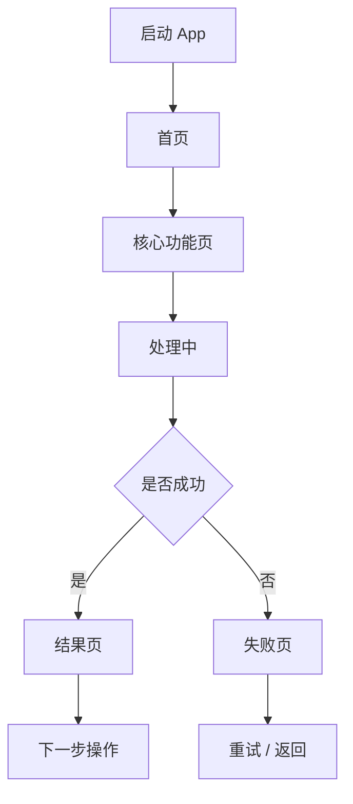
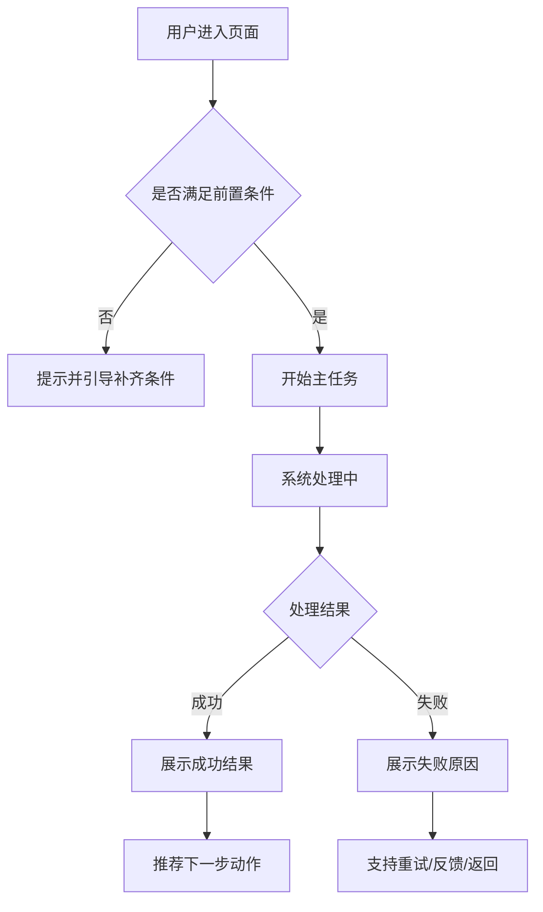
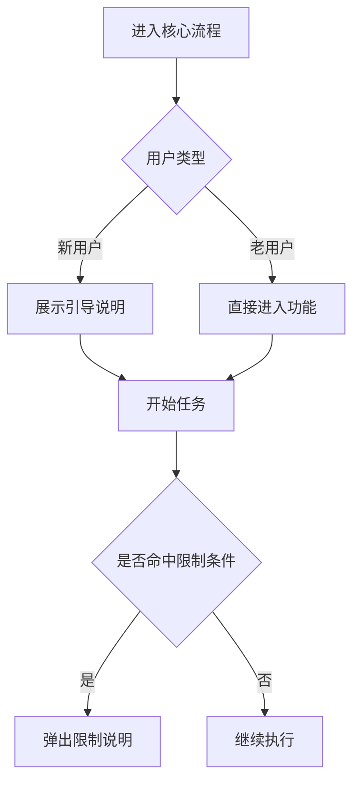
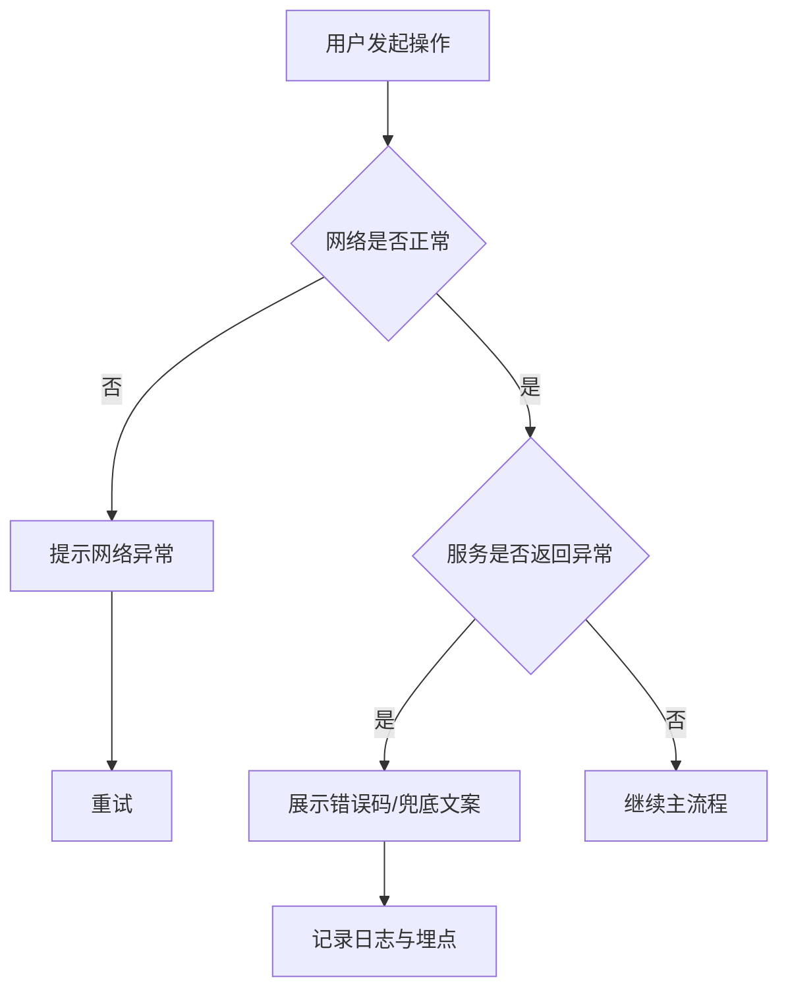
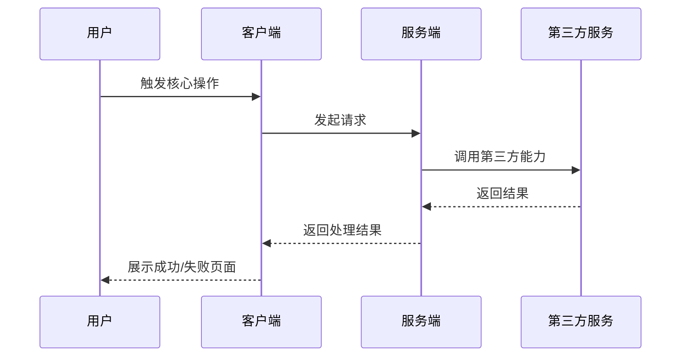
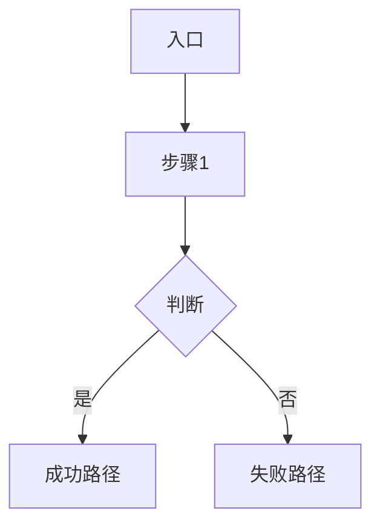
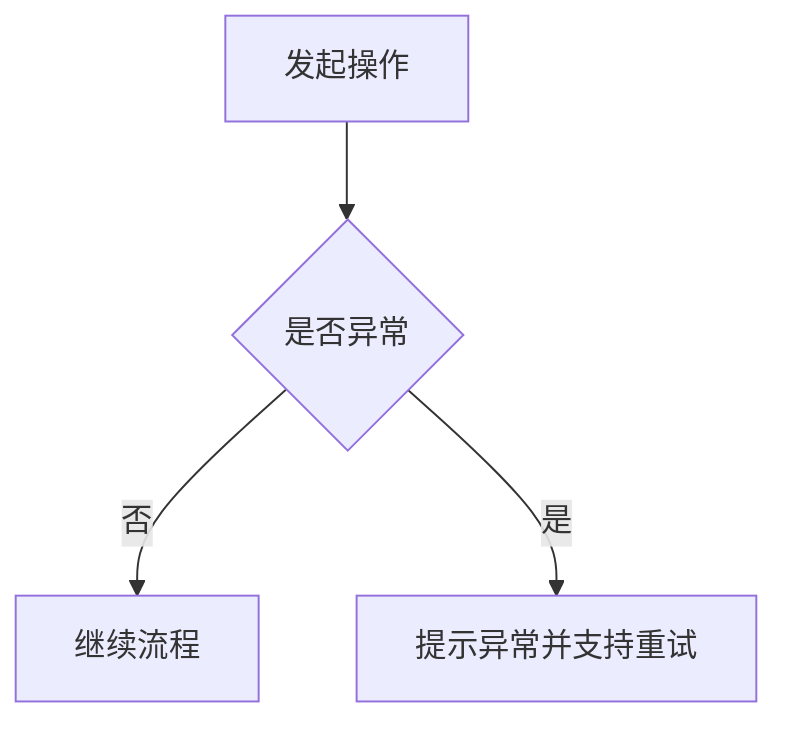

# PRD-template-complete-with-flowcharts.md

面向真实项目推进的完整 PRD 模板。目标不是写一份空泛说明，而是产出一份 **可评审、可设计、可开发、可测试、可验收、可埋点、可协作推进** 的正式产品需求文档。

适用场景：
- 新产品立项
- 新功能设计 / 老功能重构
- Google Play / 竞品分析后方案落地
- MVP 范围定义
- 带商业化、推送、审核策略、埋点、版本规划的项目

---

# [项目名称 / 功能名称] PRD

## 0. 文档信息
- 文档标题：[项目名称 / 功能名称] PRD
- 文档版本：[v1.0.0]
- 产品名称：[名称]
- 项目标识 / 包名：[包名 / 工程名]
- 负责人：[PM / Owner]
- 协作角色：[设计 / 客户端 / 服务端 / QA / 运营]
- 创建日期：[YYYY-MM-DD]
- 更新时间：[YYYY-MM-DD]
- 计划评审时间：[YYYY-MM-DD]
- 计划上线时间：[YYYY-MM-DD]
- 适用平台：[Android / iOS / Web / Server / Mini App]
- 相关链接：[原型 / Figma / 数据报表 / 埋点表 / 技术方案]

---

## 1. 变更记录
| 日期 | 版本 | 变更内容 | 变更人 |
|---|---|---|---|
| YYYY-MM-DD | v1.0.0 | 初版创建 | [姓名] |
| YYYY-MM-DD | v1.0.1 | 补充流程图与验收标准 | [姓名] |
| YYYY-MM-DD | v1.1.0 | 调整范围与版本规划 | [姓名] |

---

## 2. 文档说明

### 2.1 编写目的
本文档用于明确 [项目 / 功能] 的业务背景、用户问题、目标、范围、功能方案、流程规则、异常处理、埋点、验收标准与上线规划，作为产品、设计、研发、测试、运营协作依据。

### 2.2 阅读说明
- 正文只保留结论、规则、边界、职责与决策。
- 原始调研材料、截图、录屏、长表格、SQL、配置详情建议挂附件或附录。
- 所有“待确认”问题必须在评审前收敛，否则不能直接进入开发。

### 2.3 名词解释
| 术语 | 含义 |
|---|---|
| MVP | 最小可行版本 |
| DAU | 日活跃用户数 |
| CTR | 点击率 |
| CVR | 转化率 |
| 审核模式 | 面向审核 / 风险规避场景的保守策略 |
| 买量模式 | 面向增长 / 投放 / 变现优化场景的策略 |

---

## 3. 需求背景

### 3.1 当前现状
- 当前产品/功能现状：[一句话说明当前状态]
- 当前主要问题：[例如转化低、流程长、功能不可见、留存差、收入不足]
- 当前关键数据：[DAU / 转化率 / 留存率 / 收入 / 完成率 / 崩溃率]

### 3.2 问题定义
当前存在的核心问题包括：
1. [问题 1]
2. [问题 2]
3. [问题 3]

问题带来的影响：
- 对用户的影响：[体验差 / 无法完成目标 / 理解成本高]
- 对业务的影响：[流失 / 收入下降 / 获客转化不足 / 合规风险]

### 3.3 用户洞察 / 调研结论
- 调研方式：[访谈 / 问卷 / 评论分析 / 客服工单 / 用户录像 / 数据分析]
- 样本范围：[人数 / 国家 / 渠道 / 用户分层]
- 关键结论：
  1. [洞察 1]
  2. [洞察 2]
  3. [洞察 3]

### 3.4 竞品分析结论
- 对标产品：[竞品 A / 竞品 B / 竞品 C]
- 分析维度：[功能 / 体验 / 收费 / 广告 / 新手引导 / 通知策略]
- 结论摘要：
  1. [可借鉴点]
  2. [差异化机会]
  3. [不建议照搬点]

### 3.5 立项理由
- 为什么现在做：[时机 / 数据信号 / 战略优先级 / 客诉 / 商业目标]
- 不做的代价：[损失说明]
- 成功的定义：[版本成功后最核心的判断标准]

---

## 4. 项目目标

### 4.1 业务目标
- 目标 1：[例如提升首页到核心流程点击率 20%]
- 目标 2：[例如提升任务完成率 15%]
- 目标 3：[例如提升广告 ARPDAU 10%]

### 4.2 用户目标
- 用户能更快理解：[什么价值]
- 用户能更顺畅完成：[什么任务]
- 用户在关键节点减少：[什么阻碍]

### 4.3 非目标
本期明确不做：
- [非目标 1]
- [非目标 2]
- [非目标 3]

### 4.4 成功指标
| 指标 | 当前值 | 目标值 | 统计口径 | 观察周期 |
|---|---|---|---|---|
| 核心入口点击率 | [x] | [y] | [定义] | [7天/14天] |
| 核心流程完成率 | [x] | [y] | [定义] | [7天/14天] |
| 收入指标 | [x] | [y] | [定义] | [7天/14天] |

---

## 5. 用户与场景

### 5.1 目标用户分层
| 用户类型 | 特征 | 核心诉求 | 优先级 |
|---|---|---|---|
| 核心用户 | [描述] | [诉求] | 高 |
| 次级用户 | [描述] | [诉求] | 中 |
| 特殊用户 | [审核用户/自然量/投放用户/特定地区] | [诉求] | 中 |

### 5.2 核心使用场景
1. 当用户处于 [场景 A] 时，希望可以 [任务]，以便 [目标]。
2. 当用户处于 [场景 B] 时，希望可以 [任务]，以便 [目标]。
3. 当用户处于 [场景 C] 时，希望可以 [任务]，以便 [目标]。

### 5.3 用户故事
- 作为 [用户角色]，我希望 [行为]，从而 [收益]。
- 作为 [用户角色]，我希望 [行为]，从而 [收益]。

---

## 6. 范围定义

### 6.1 In Scope / Out of Scope
| 模块 | In Scope | Out of Scope | 备注 |
|---|---|---|---|
| 首页改版 | ✅ |  | [备注] |
| 核心流程优化 | ✅ |  | [备注] |
| 新增后台配置 | ✅ |  | [备注] |
| iOS 同步改版 |  | ❌ | 本期不做 |
| 海外多语言扩展 |  | ❌ | 下期考虑 |

### 6.2 MVP 范围
MVP 必须具备：
- [能力 1]
- [能力 2]
- [能力 3]

可延后能力：
- [能力 A]
- [能力 B]

### 6.3 模块结构
- 模块 1：[说明]
- 模块 2：[说明]
- 模块 3：[说明]

---

## 7. 信息架构 / 页面结构

### 7.1 信息架构说明
描述用户从入口到完成核心任务的页面与模块关系。

### 7.2 页面清单
| 页面 / 模块 | 功能说明 | 入口 | 出口 | 备注 |
|---|---|---|---|---|
| 首页 | [说明] | App 启动 | 核心功能页 | |
| 功能结果页 | [说明] | 主流程完成后 | 分享 / 返回 / 下一步 | |
| 设置页 | [说明] | 右上角入口 | 返回首页 | |

### 7.3 页面跳转图（可选 Mermaid）


---

## 8. 核心流程图

这一章必须有，不能只写“见原型”。至少覆盖主流程、关键分支、失败流程、退出路径。

### 8.1 主流程图


### 8.2 关键分支流程图


### 8.3 异常流程图


### 8.4 时序图（可选，适合客户端/服务端/第三方协作）


### 8.5 流程图绘制要求
- 必须标清入口、动作、判断、结果、退出路径。
- 判断节点至少覆盖成功 / 失败 / 不满足条件三类情况。
- 如果有审核模式 / 会员态 / 登录态差异，需单独标分支。
- 如果流程超过 12 个节点，建议拆为“主流程 + 异常流程 + 特殊分支”。

---

## 9. 功能详细规格

建议每个核心功能都按同一结构展开，方便评审和研发理解。

### 9.1 功能总览
| 功能 | 目标 | 优先级 | 版本 | Owner |
|---|---|---|---|---|
| [功能 A] | [目标] | P0 | v1.0 | [姓名] |
| [功能 B] | [目标] | P1 | v1.0 | [姓名] |
| [功能 C] | [目标] | P1 | v1.1 | [姓名] |

---

### 9.2 功能模板

#### 功能名称：[填写功能名]

**1）功能目标**
- [该功能解决什么问题，带来什么价值]

**2）入口**
- [从哪里进入]

**3）角色 / 适用用户**
- [哪些用户可见，哪些用户不可见]

**4）前置条件**
- [登录态 / 权限 / 配置 / 网络 / 地域 / 版本要求]

**5）输入 / 输出**
- 输入：[用户输入 / 系统输入 / 配置输入]
- 输出：[界面输出 / 状态输出 / 数据输出]

**6）主流程**
1. [步骤 1]
2. [步骤 2]
3. [步骤 3]
4. [步骤 4]

**7）异常流程**
1. [异常情况 1 的处理]
2. [异常情况 2 的处理]
3. [异常情况 3 的处理]

**8）业务规则**
- [规则 1]
- [规则 2]
- [规则 3]

**9）状态定义**
| 状态 | 触发条件 | 页面表现 | 允许操作 |
|---|---|---|---|
| 初始态 | [条件] | [表现] | [操作] |
| 加载态 | [条件] | [表现] | [操作] |
| 成功态 | [条件] | [表现] | [操作] |
| 空态 | [条件] | [表现] | [操作] |
| 异常态 | [条件] | [表现] | [操作] |

**10）边界条件**
- [边界 1]
- [边界 2]
- [边界 3]

**11）埋点要求**
| 事件名 | 触发时机 | 关键属性 | 目的 |
|---|---|---|---|
| [event_name] | [时机] | [属性] | [目的] |

**12）验收标准**
- [验收项 1]
- [验收项 2]
- [验收项 3]

---

## 10. 页面与交互要求

### 10.1 页面级要求
| 页面 | 设计目标 | 必备元素 | 可选元素 | 禁止项 |
|---|---|---|---|---|
| 首页 | [目标] | [元素] | [元素] | [禁止项] |
| 结果页 | [目标] | [元素] | [元素] | [禁止项] |

### 10.2 交互规则
- 点击反馈时长：[如 100ms 内]
- 加载反馈：[骨架屏 / loading / 进度条]
- 重试机制：[按钮 / 自动重试次数]
- 返回逻辑：[返回上一页 / 返回首页 / 保持状态]
- 权限拒绝处理：[文案 + 引导]

### 10.3 文案规范
- CTA 文案：[例如“立即开始”“继续恢复”]
- 错误文案要求：[清楚、可行动、避免技术黑话]
- 空态文案要求：[说明原因 + 给下一步建议]

---

## 11. 数据与埋点设计

### 11.1 埋点目标
- 评估用户是否进入关键流程
- 评估用户是否完成核心任务
- 评估广告 / 通知 / 弹窗策略是否有效
- 评估异常率与失败点分布

### 11.2 埋点清单
| 模块 | 事件名 | 触发时机 | 关键属性 | 用途 |
|---|---|---|---|---|
| 首页 | home_show | 首页曝光 | source, mode | 看首页流量 |
| 核心流程 | core_start | 点击开始 | source, user_type | 看漏斗起点 |
| 核心流程 | core_success | 流程成功 | duration, result_type | 看完成率 |
| 核心流程 | core_fail | 流程失败 | error_code, step | 看失败原因 |

### 11.3 公共属性
- user_id
- country
- language
- app_version
- os_version
- device_brand
- network_type
- channel
- mode
- attribution_info

### 11.4 数据看板建议
- 核心漏斗
- 页面转化对比
- 异常率趋势
- 不同模式 / 渠道 / 国家分层效果

---

## 12. 商业化 / 增长策略（按需保留）

### 12.1 商业目标
- [例如提升广告收益]
- [例如提升订阅转化]

### 12.2 广告策略
| 点位 | 页面 | 触发时机 | 频控 | 用户分层差异 | 备注 |
|---|---|---|---|---|---|
| Banner | 首页 | 页面曝光 | [规则] | [差异] | |
| Interstitial | 结果页前 | 点击下一步前 | [规则] | [差异] | |
| Native | 列表页 | 滚动到指定位置 | [规则] | [差异] | |

### 12.3 增长机制
- 新手引导：[策略]
- 激励机制：[积分 / 奖励 / 限时引导]
- 分享机制：[分享场景 / 文案 / 落地页]
- Push / 站内信：[触发逻辑]

---

## 13. 配置化与策略控制

### 13.1 可配置项
| 配置项 | 类型 | 默认值 | 生效端 | 备注 |
|---|---|---|---|---|
| feature_switch | bool | true | 客户端 | 功能开关 |
| popup_frequency | int | 3 | 客户端 | 弹窗频次 |
| route_target | string | /home | 客户端 | 页面跳转 |

### 13.2 模式策略
- 审核模式：[说明]
- 买量模式：[说明]
- 自然量模式：[说明]

### 13.3 客户端 / 服务端职责边界
- 客户端负责：[展示、交互、兜底、缓存]
- 服务端负责：[配置下发、规则计算、数据汇总]
- 第三方负责：[消息推送 / 支付 / 广告投放等]

---

## 14. 非功能需求

### 14.1 性能要求
- 页面打开耗时：[例如 < 2s]
- 核心流程响应时长：[例如 < 1s 返回首帧]
- 崩溃率要求：[例如 < 0.3%]

### 14.2 稳定性要求
- 异常必须有兜底文案
- 弱网环境需可重试
- 关键流程失败需上报日志

### 14.3 安全与合规
- 用户数据权限说明
- 敏感数据脱敏要求
- 合规弹窗 / 隐私授权要求

### 14.4 兼容性要求
- 支持系统版本：[范围]
- 支持设备范围：[范围]
- 特殊机型适配：[范围]

---

## 15. 技术实现约束
- 必须兼容：[旧版本 / 现有路由 / 现有服务]
- 不允许影响：[已有核心流程 / 商业化稳定性]
- 需复用组件：[已有组件名]
- 需预留扩展点：[后续版本能力]

---

## 16. 验收标准

### 16.1 产品验收
- 功能范围与 PRD 一致
- 流程分支与规则实现完整
- 页面与文案符合交互说明

### 16.2 研发验收
- 接口返回与字段定义一致
- 异常分支均有处理
- 配置项可灰度 / 可关闭 / 可回滚

### 16.3 测试验收
- 主流程通过
- 异常流程通过
- 边界条件通过
- 兼容性验证通过

### 16.4 数据验收
- 埋点按清单完整接入
- 事件参数正确
- 看板可正确出数

---

## 17. 项目计划

### 17.1 里程碑
| 阶段 | 时间 | 输出物 | Owner |
|---|---|---|---|
| 需求评审 | [时间] | PRD v1 | PM |
| 原型输出 | [时间] | 原型图 | 设计 |
| 技术评审 | [时间] | 技术方案 | 研发 |
| 开发联调 | [时间] | 提测包 | 研发 |
| QA 验收 | [时间] | 测试报告 | QA |
| 上线发布 | [时间] | 正式版本 | PM / 研发 |

### 17.2 依赖项
- [依赖 1]
- [依赖 2]
- [依赖 3]

### 17.3 风险项
| 风险 | 描述 | 影响 | 应对措施 |
|---|---|---|---|
| 技术风险 | [描述] | 高/中/低 | [措施] |
| 资源风险 | [描述] | 高/中/低 | [措施] |
| 合规风险 | [描述] | 高/中/低 | [措施] |

---

## 18. 待确认事项
- [待确认问题 1]
- [待确认问题 2]
- [待确认问题 3]

---

## 19. 附录
- 用户调研报告
- 竞品分析报告
- 数据分析报告
- 原型图 / 视觉稿
- 埋点表
- 路由表 / 配置表
- 技术方案文档
- 接口定义文档

---

## 20. 快速复制版

下面这段可以直接复制去新文档开写：

```md
# [项目名称 / 功能名称] PRD

## 1. 文档信息
- 文档版本：
- 负责人：
- 创建日期：
- 计划上线时间：
- 适用平台：

## 2. 需求背景
- 当前现状：
- 核心问题：
- 用户洞察：
- 竞品结论：
- 立项理由：

## 3. 项目目标
- 业务目标：
- 用户目标：
- 非目标：
- 成功指标：

## 4. 用户与场景
- 目标用户：
- 核心场景：
- 用户故事：

## 5. 范围定义
- In Scope：
- Out of Scope：
- MVP 范围：

## 6. 信息架构
- 页面清单：
- 页面跳转关系：

## 7. 核心流程图
### 主流程图


### 异常流程图


## 8. 功能详细规格
### 功能：[功能名]
- 目标：
- 入口：
- 前置条件：
- 主流程：
- 异常流程：
- 业务规则：
- 状态定义：
- 埋点要求：
- 验收标准：

## 9. 页面与交互要求
- 页面要求：
- 交互规则：
- 文案规范：

## 10. 数据与埋点
- 埋点目标：
- 埋点清单：
- 公共属性：

## 11. 非功能需求
- 性能：
- 稳定性：
- 合规：
- 兼容性：

## 12. 验收标准
- 产品验收：
- 测试验收：
- 数据验收：

## 13. 项目计划
- 里程碑：
- 风险：
- 依赖：
- 待确认事项：
```

---

## 21. 使用建议
- 如果你现在只是要“标准模板”，直接复制第 20 节即可。
- 如果你要“能直接拿去评审的正式版”，按第 1 到第 19 节完整填写。
- 流程图建议至少保留 2 张：主流程图 + 异常流程图。
- 如果你愿意，我还可以继续帮你出一版 **更适合飞书文档排版的版本**，包括标题层级、表格风格和更好复制的 Mermaid 块。
