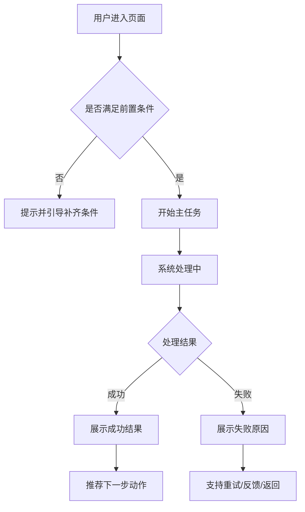
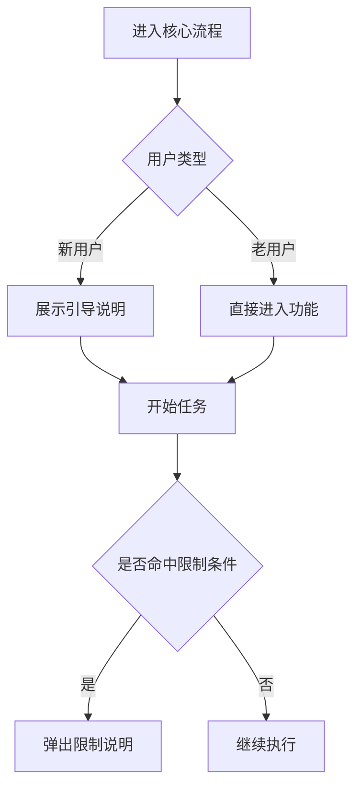
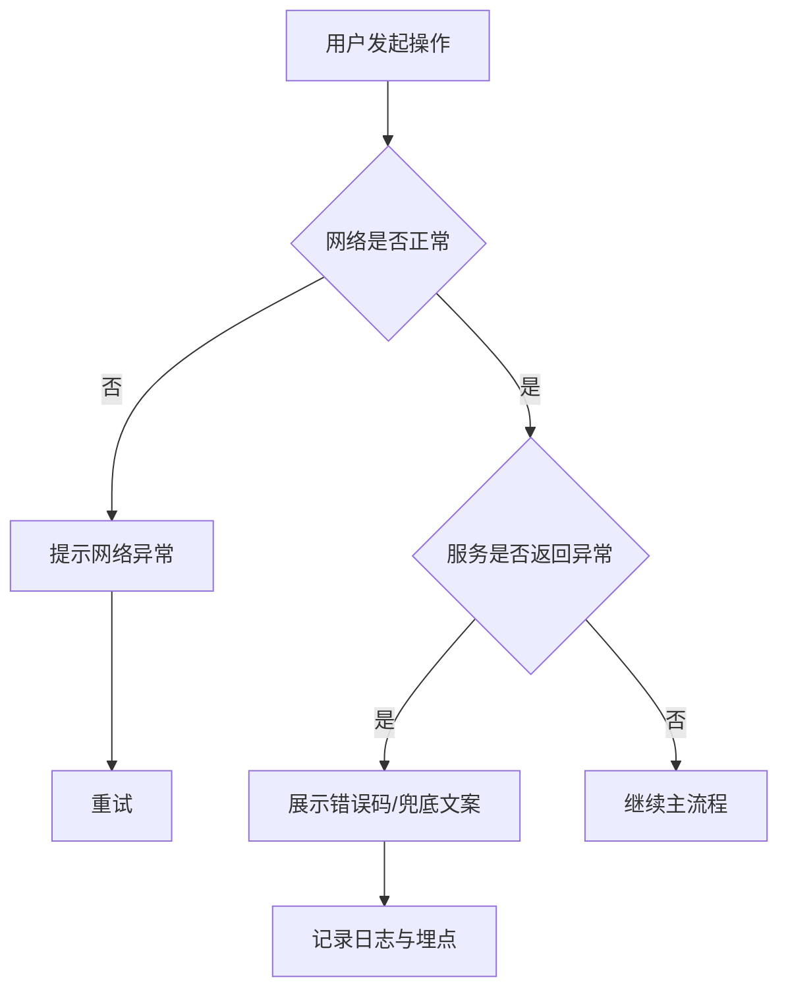

# PRD-template-feishu-fixed.md

适合直接复制到飞书文档中的固定 PRD 模板。

特点：
- 标题层级清晰，适合飞书文档目录
- 表格数量适中，不会太难维护
- 流程图章节固定保留
- 可直接复制整篇使用
- 即使是轻量需求，也能保持统一结构

使用规则：
- 默认不要删章节，只填内容
- 没有内容的章节写“本期不涉及”或“无”
- 流程图章节至少保留主流程图和异常流程图
- 详细功能部分可按模块复制多份

---

# [项目名称 / 功能名称] PRD

## 1. 文档信息
- 文档名称：[项目名称 / 功能名称] PRD
- 文档版本：[v1.0.0]
- 负责人：[姓名]
- 协作人：[产品 / 设计 / 客户端 / 服务端 / QA / 运营]
- 创建日期：[YYYY-MM-DD]
- 更新时间：[YYYY-MM-DD]
- 计划评审时间：[YYYY-MM-DD]
- 计划上线时间：[YYYY-MM-DD]
- 适用平台：[Android / iOS / Web / Server]
- 相关链接：[原型 / 数据报表 / 技术方案 / 埋点表]

## 2. 变更记录
| 日期 | 版本 | 变更内容 | 变更人 |
|---|---|---|---|
| YYYY-MM-DD | v1.0.0 | 初版创建 | [姓名] |
| YYYY-MM-DD | v1.0.1 | 补充流程图 / 规则细节 | [姓名] |

## 3. 需求背景
### 3.1 当前现状
- 当前产品/功能现状：[一句话说明]
- 当前主要问题：[问题描述]
- 当前关键数据：[数据指标]

### 3.2 问题定义
- 问题 1：[描述]
- 问题 2：[描述]
- 问题 3：[描述]

### 3.3 用户洞察
- 调研方式：[访谈 / 评论分析 / 数据分析 / 工单]
- 样本范围：[人数 / 国家 / 渠道 / 分层]
- 关键结论：
  1. [结论 1]
  2. [结论 2]
  3. [结论 3]

### 3.4 竞品分析结论
- 对标产品：[竞品 A / 竞品 B / 竞品 C]
- 结论摘要：
  1. [可借鉴点]
  2. [差异化机会]
  3. [不建议照搬点]

### 3.5 立项理由
- 为什么现在做：[原因]
- 不做的代价：[影响]
- 成功定义：[标准]

## 4. 项目目标
### 4.1 业务目标
- 目标 1：[例如提升转化率]
- 目标 2：[例如提升完成率]
- 目标 3：[例如提升收入]

### 4.2 用户目标
- 用户可以更快完成：[任务]
- 用户可以更清楚理解：[价值]
- 用户在关键节点减少：[阻碍]

### 4.3 非目标
- 本期不做：[内容 1]
- 本期不做：[内容 2]
- 本期不做：[内容 3]

### 4.4 成功指标
| 指标 | 当前值 | 目标值 | 口径 |
|---|---|---|---|
| 核心入口点击率 | [x] | [y] | [定义] |
| 核心流程完成率 | [x] | [y] | [定义] |
| 收入指标 | [x] | [y] | [定义] |

## 5. 用户与场景
### 5.1 目标用户
| 用户类型 | 特征 | 核心诉求 | 优先级 |
|---|---|---|---|
| 核心用户 | [描述] | [诉求] | 高 |
| 次级用户 | [描述] | [诉求] | 中 |
| 特殊用户 | [描述] | [诉求] | 中 |

### 5.2 核心场景
1. 当用户处于 [场景 A] 时，希望可以 [任务]，以便 [目标]。
2. 当用户处于 [场景 B] 时，希望可以 [任务]，以便 [目标]。
3. 当用户处于 [场景 C] 时，希望可以 [任务]，以便 [目标]。

### 5.3 用户故事
- 作为 [用户角色]，我希望 [行为]，从而 [收益]。
- 作为 [用户角色]，我希望 [行为]，从而 [收益]。

## 6. 范围定义
### 6.1 In Scope / Out of Scope
| 模块 | In Scope | Out of Scope | 备注 |
|---|---|---|---|
| [模块 A] | ✅ |  | [备注] |
| [模块 B] | ✅ |  | [备注] |
| [模块 C] |  | ❌ | [备注] |

### 6.2 MVP 范围
- MVP 必须具备：[能力 1]
- MVP 必须具备：[能力 2]
- MVP 必须具备：[能力 3]
- 可延后能力：[能力 A / 能力 B]

### 6.3 模块结构
- 模块 1：[说明]
- 模块 2：[说明]
- 模块 3：[说明]

## 7. 信息架构 / 页面结构
### 7.1 页面清单
| 页面 / 模块 | 功能说明 | 入口 | 出口 | 备注 |
|---|---|---|---|---|
| 首页 | [说明] | App 启动 | 核心页 | |
| 核心功能页 | [说明] | 首页入口 | 结果页 | |
| 结果页 | [说明] | 主流程完成后 | 分享 / 返回 | |

### 7.2 页面关系说明
- 首页进入：[页面 A]
- 页面 A 完成后进入：[页面 B]
- 页面 B 可回流到：[页面 C]

## 8. 核心流程图

> 本章节固定保留，不能删除。

### 8.1 主流程图

### 8.2 关键分支流程图

### 8.3 异常流程图

### 8.4 流程图填写要求
- 必须包含入口、动作、判断、结果、退出路径
- 至少覆盖成功、失败、不满足条件三种情况
- 超过 12 个节点时建议拆图
- 特殊模式差异必须单独标注

## 9. 功能详细规格

> 以下模块可按实际功能重复复制。

### 9.1 功能总览
| 功能 | 目标 | 优先级 | 版本 | Owner |
|---|---|---|---|---|
| [功能 A] | [目标] | P0 | v1.0 | [姓名] |
| [功能 B] | [目标] | P1 | v1.0 | [姓名] |

### 9.2 功能详情
#### 功能名称：[填写功能名]

**功能目标**
- [说明]

**入口**
- [说明]

**适用用户**
- [说明]

**前置条件**
- [说明]

**输入 / 输出**
- 输入：[说明]
- 输出：[说明]

**主流程**
1. [步骤 1]
2. [步骤 2]
3. [步骤 3]

**异常流程**
1. [异常 1]
2. [异常 2]
3. [异常 3]

**业务规则**
- [规则 1]
- [规则 2]
- [规则 3]

**状态定义**
| 状态 | 触发条件 | 页面表现 | 允许操作 |
|---|---|---|---|
| 初始态 | [条件] | [表现] | [操作] |
| 加载态 | [条件] | [表现] | [操作] |
| 成功态 | [条件] | [表现] | [操作] |
| 异常态 | [条件] | [表现] | [操作] |

**边界条件**
- [边界 1]
- [边界 2]

**埋点要求**
| 事件名 | 触发时机 | 关键属性 | 目的 |
|---|---|---|---|
| [event_name] | [时机] | [属性] | [目的] |

**验收标准**
- [验收项 1]
- [验收项 2]
- [验收项 3]

## 10. 页面与交互要求
### 10.1 页面要求
| 页面 | 设计目标 | 必备元素 | 禁止项 |
|---|---|---|---|
| 首页 | [目标] | [元素] | [禁止项] |
| 结果页 | [目标] | [元素] | [禁止项] |

### 10.2 交互规则
- 点击反馈时长：[要求]
- 加载反馈：[要求]
- 重试机制：[要求]
- 返回逻辑：[要求]
- 权限拒绝处理：[要求]

### 10.3 文案规范
- CTA 文案：[要求]
- 错误文案：[要求]
- 空态文案：[要求]

## 11. 数据与埋点设计
### 11.1 埋点目标
- [目标 1]
- [目标 2]
- [目标 3]

### 11.2 埋点清单
| 模块 | 事件名 | 触发时机 | 关键属性 | 用途 |
|---|---|---|---|---|
| 首页 | home_show | 首页曝光 | source, mode | 看流量 |
| 核心流程 | core_start | 点击开始 | source, user_type | 看漏斗 |
| 核心流程 | core_success | 流程成功 | duration, result_type | 看完成率 |
| 核心流程 | core_fail | 流程失败 | error_code, step | 看失败原因 |

### 11.3 公共属性
- user_id
- country
- language
- app_version
- os_version
- channel
- mode

## 12. 商业化 / 增长策略
### 12.1 商业目标
- [目标] / 本期不涉及

### 12.2 广告策略
| 点位 | 页面 | 触发时机 | 频控 | 备注 |
|---|---|---|---|---|
| Banner | 首页 | 页面曝光 | [规则] | |
| Interstitial | 结果页前 | 点击下一步前 | [规则] | |

### 12.3 增长机制
- 新手引导：[说明]
- 激励机制：[说明]
- Push / 站内信：[说明]

## 13. 配置化与策略控制
### 13.1 可配置项
| 配置项 | 类型 | 默认值 | 生效端 | 备注 |
|---|---|---|---|---|
| feature_switch | bool | true | 客户端 | 功能开关 |
| route_target | string | /home | 客户端 | 页面跳转 |

### 13.2 模式策略
- 审核模式：[说明] / 本期不涉及
- 买量模式：[说明] / 本期不涉及

### 13.3 职责边界
- 客户端负责：[说明]
- 服务端负责：[说明]
- 第三方负责：[说明]

## 14. 非功能需求
### 14.1 性能要求
- 页面打开耗时：[要求]
- 核心流程响应时长：[要求]
- 崩溃率要求：[要求]

### 14.2 稳定性要求
- [要求 1]
- [要求 2]

### 14.3 安全与合规
- [要求 1]
- [要求 2]

### 14.4 兼容性要求
- 支持系统版本：[范围]
- 支持设备范围：[范围]

## 15. 技术实现约束
- [约束 1]
- [约束 2]
- [约束 3]

## 16. 验收标准
### 16.1 产品验收
- [标准 1]
- [标准 2]

### 16.2 研发验收
- [标准 1]
- [标准 2]

### 16.3 测试验收
- [标准 1]
- [标准 2]

### 16.4 数据验收
- [标准 1]
- [标准 2]

## 17. 项目计划
### 17.1 里程碑
| 阶段 | 时间 | 输出物 | Owner |
|---|---|---|---|
| 需求评审 | [时间] | PRD v1 | PM |
| 原型输出 | [时间] | 原型图 | 设计 |
| 技术评审 | [时间] | 技术方案 | 研发 |
| 开发联调 | [时间] | 提测包 | 研发 |
| QA 验收 | [时间] | 测试报告 | QA |
| 上线发布 | [时间] | 正式版本 | PM / 研发 |

### 17.2 依赖项
- [依赖 1] / 无
- [依赖 2] / 无

### 17.3 风险项
| 风险 | 描述 | 影响 | 应对措施 |
|---|---|---|---|
| 技术风险 | [描述] | 高/中/低 | [措施] |
| 资源风险 | [描述] | 高/中/低 | [措施] |
| 合规风险 | [描述] | 高/中/低 | [措施] |

## 18. 待确认事项
- [待确认 1]
- [待确认 2]
- [待确认 3]

## 19. 附录
- 用户调研报告
- 竞品分析报告
- 数据分析报告
- 原型图 / 视觉稿
- 埋点表
- 技术方案文档

---

## 固定使用建议
- 新项目默认复制本模板
- 轻量需求也尽量不要少于第 3、4、6、8、9、11、16、17 章
- 第 8 章流程图为固定必填
- 第 9 章功能详情可按模块重复复制
- 商业化、配置化无内容时写“本期不涉及”
